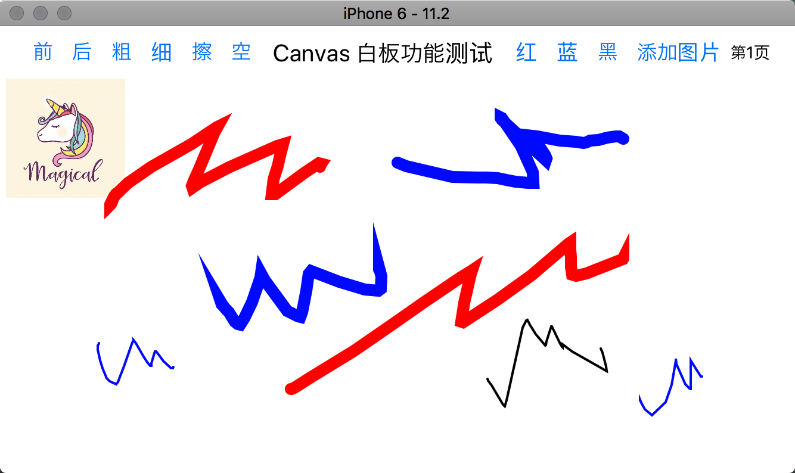

# React Native 画板Demo实现

## 引用库

```javascript
import Orientation from 'react-native-orientation'
import { SketchCanvas } from './src/@terrylinla/react-native-sketch-canvas';
import Canvas, { Image as CanvasImage } from 'react-native-canvas';
```

## 功能

1. 笔刷大小

2. 笔刷颜色

3. 橡皮擦

4. 清空画布

5. 添加图片

6. 多页画布

### 预览图

